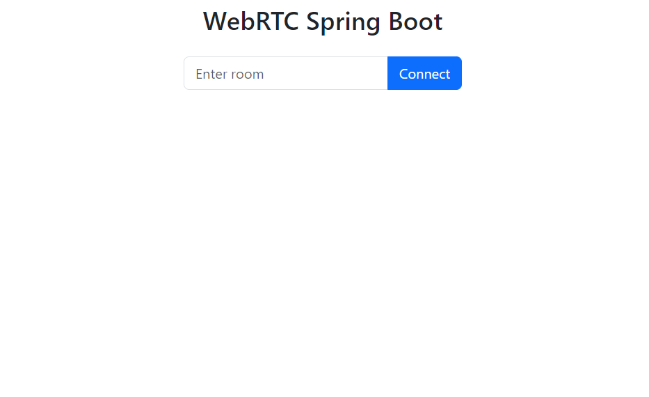
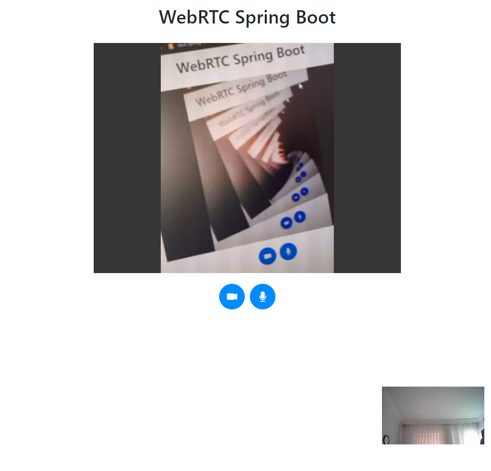
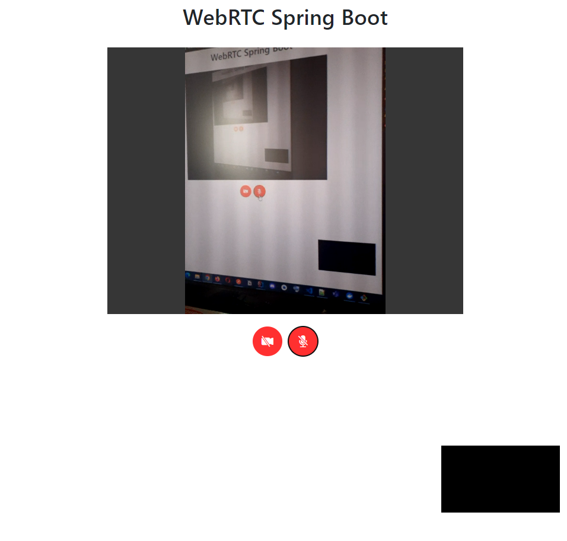

# Spring Boot WebRTC Peer-to-Peer Video Communication Room Based

#### Technologies:

- WebRTC
- Socket.IO
- BootStrap


WebRTC (Web Real-Time Communication): An open-source project that provides real-time communication between web browsers and mobile applications. Mostly used for video, audio communications, screen sharing, and streaming.


SocketIO: A JavaScript library designed for real-time, bidirectional communication. In this project, I have implemented "netty-socket.io" ( Java Spring Boot compatible) as a signaling mechanism.


### Instructions


#### write your local ip for each step

1) **Generate certificates:** 
   - you can use git bash 
   - write your local ip address of your computer/host like `192.168.0.3` 
   - please create an empty ssl folder under the project directory


`mkdir ssl && openssl req -x509 -nodes -days 365 -newkey rsa:2048 -keyout ssl/private_key.pem -out ssl/certificate.pem -subj "//C=US//ST=California//L=San Francisco//O=MyOrganization//OU=MyDepartment//CN=<YOUR_LOCAL_IP>"`

2) **update nginx.conf**

change `<YOUR_LOCAL_IP>` with your local ip same as step 1

3) **update client.js file in resources**

file location: `src/main/resources/static/client.js`

```let socket = io.connect("https://<YOUR_LOCAL_IP>", {secure: true});```

4) **build docker image**

`docker-compose up -d --build`

### Examples

#### video

[https://www.youtube.com/watch?v=nbOB8ekk3xM](https://www.youtube.com/watch?v=nbOB8ekk3xM)

#### phone + computer connection example








